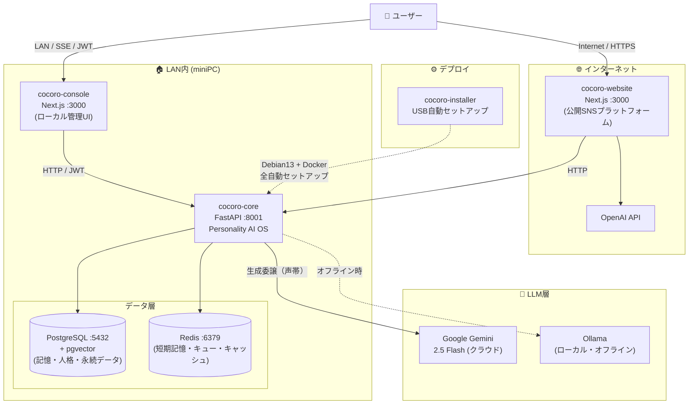
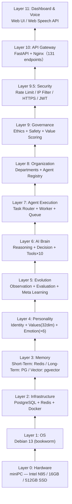
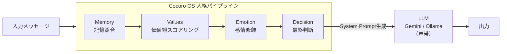
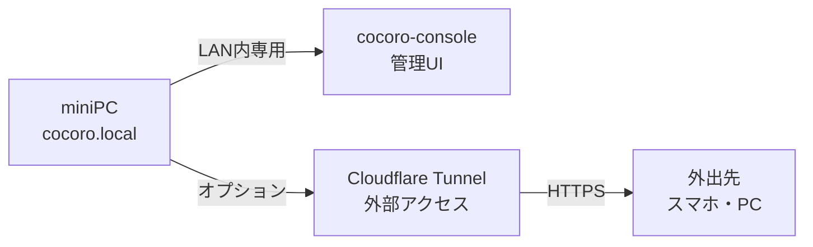

import Tabs from '@theme/Tabs';
import TabItem from '@theme/TabItem';

# 📐 アーキテクチャ概要

Cocoro OS は **11 層構造**で設計されており、ハードウェアから Web UI まで一貫したアーキテクチャを持ちます。

---

## システム全体図

---

## 11 層アーキテクチャ

| 層 | 名称 | 技術 | 役割 |
|----|------|------|------|
| 11 | Dashboard & Voice | Web UI / Web Speech API | ユーザーインターフェース |
| 10 | API Gateway | FastAPI + Nginx | 131 エンドポイント |
| 9.5 | Security | Rate Limit / JWT / HTTPS | セキュリティ多層防御 |
| 9 | Governance | Ethics + Safety Engine | 倫理・安全チェック |
| 8 | Organization | Agent Registry | 部署・エージェント管理 |
| 7 | Agent Execution | Task Router + Queue | タスク自律実行 |
| 6 | AI Brain | Reasoning + Tools×10 | 推論・ツール実行 |
| 5 | Evolution | Meta Learning | 自己進化・学習 |
| 4 | Personality | Values×32 + Emotion×6 | **人格の核心** |
| 3 | Memory | Redis + PG + pgvector | 3層記憶システム |
| 2 | Infrastructure | PostgreSQL + Redis | データ永続化 |
| 1 | OS | Debian 13 | オペレーティングシステム |
| 0 | Hardware | Intel N95 miniPC | 物理ハードウェア |

---

## アーキテクチャの原則

### 1. LLM は「声帯」

LLM は「何を言うか」を生成するだけ。**「誰として言うか」は Cocoro OS が決定**します。
LLM を Gemini から Ollama に変えても、人格は 100% 維持されます。

:::caution Decision Graph パイプライン順序は必ず守ること
**Memory → Value → Emotion → Decision** の順序は変更不可。
順序を変えると人格の一貫性が崩れます。
:::

### 2. ローカルファースト

すべてのデータはローカルに保存。インターネット接続は Gemini API 通信のみで、Ollama 使用時は完全オフライン動作が可能。

### 3. 2フロントエンド構成

| | cocoro-console | cocoro-website |
|--|---------------|----------------|
| 用途 | ローカル管理 UI | 公開 SNS プラットフォーム |
| ネットワーク | LAN 内専用 | インターネット公開 |
| 認証 | Ed25519 デバイス認証 | JWT / NextAuth.js |
| DB | SQLite | PostgreSQL + Prisma |
| AI 連携 | cocoro-core 直接 | OpenAI API + cocoro-core |

---

## テックスタック一覧

<Tabs>
  <TabItem value="core" label="cocoro-core" default>

| Component | Technology | Version |
|-----------|-----------|---------|
| Language | Python | 3.11 |
| API Framework | FastAPI | 0.109 |
| LLM (Cloud) | Google Gemini | 2.5 Flash |
| LLM (Local) | Ollama | latest |
| Database | PostgreSQL + pgvector | 16 |
| Cache / Queue | Redis | 7 |
| Container | Docker Compose + Nginx | latest |
| Test | pytest + pytest-asyncio | 231 tests |

  </TabItem>
  <TabItem value="console" label="cocoro-console">

| レイヤー | 技術 |
|---------|------|
| Framework | Next.js 16 (App Router) |
| Language | TypeScript |
| Style | Vanilla CSS（クリームテーマ）|
| Animation | Framer Motion |
| Database | SQLite (better-sqlite3) |
| Security | AES-256-GCM / Ed25519 |

  </TabItem>
  <TabItem value="website" label="cocoro-website">

| レイヤー | 技術 |
|---------|------|
| Framework | Next.js 16 (App Router) |
| Language | TypeScript 5 |
| Style | Tailwind CSS 4 |
| AI | OpenAI API |
| Database | PostgreSQL + Prisma |
| 認証 | JWT / NextAuth.js |

  </TabItem>
</Tabs>
