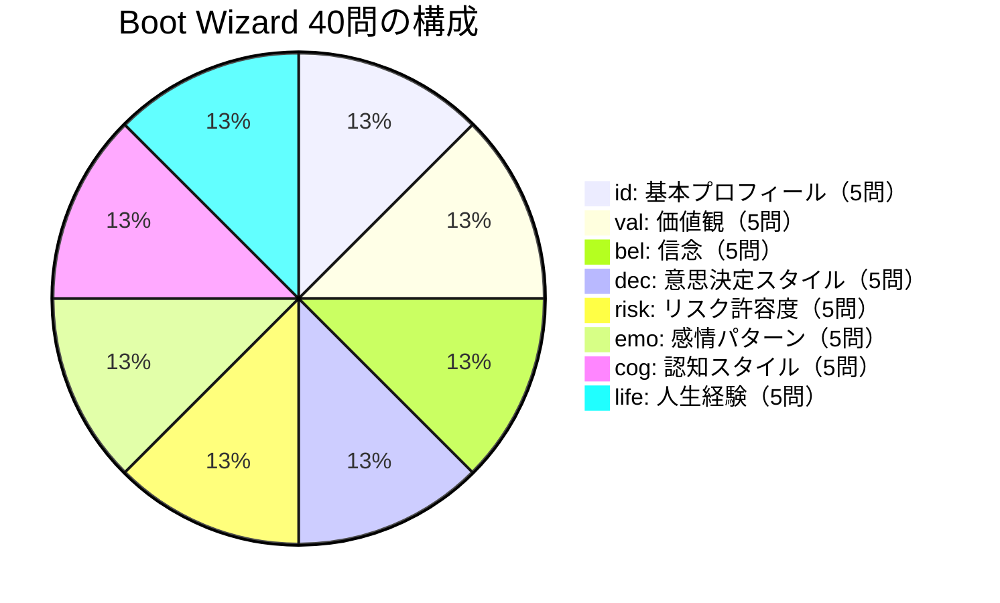

# 🧙 Boot Wizard 完走ガイド

Boot Wizard は Cocoro OS の「初回人格設定ウィザード」です。
**40 問の質問**に答えることで、AI の人格の基盤が形成されます。
ここで設定した内容がすべての会話・行動・判断の基盤になります。

:::tip 所要時間の目安
丁寧に答えると **15〜20 分** かかります。
急いで適当に答えると初期シンクロ率が低くなるため、じっくり取り組むことを推奨します。
:::

---

## Boot Wizard の起動

インストール完了後、ブラウザで cocoro-console にアクセスします。

```bash
http://cocoro.local:3000
# または IP アドレスで
http://192.168.x.xxx:3000
```

初回アクセス時は自動的に Boot Wizard が起動します。

---

## 40 問の構成

Boot Wizard は **8 カテゴリ × 5 問** の合計 40 問で構成されています。



---

## カテゴリ 1: 基本プロフィール（id_01〜05）

あなた自身の基本的な情報を設定します。これが Cocoro の「あなたの理解」の土台になります。

| 問番号 | 質問テーマ | 設定する内容 | Cocoroへの影響 |
|--------|-----------|------------|--------------|
| **id_01** | お名前 | あなたの呼ばれ方（ニックネームも可）| Cocoro があなたを呼ぶ名前 |
| **id_02** | 職業・肩書 | エンジニア / デザイナー / 学生 など | 会話の専門性・タスクの種類の前提 |
| **id_03** | 趣味・関心 | 好きなことや熱中していること | リサーチ・提案のテーマ選択 |
| **id_04** | 性格の自己評価 | 自分を一言で表すと？ | 会話スタイル・返答のトーン |
| **id_05** | 日常の過ごし方 | 朝型 / 夜型、在宅 / 外出が多いなど | スケジュール管理・リマインダーの最適化 |

**記入例（id_02）:**
```
「フリーランスのソフトウェアエンジニアです。
主にバックエンド開発（Python / FastAPI）を担当しています。
副業でAIプロダクトの開発もしています。」
```

---

## カテゴリ 2: 価値観（val_01〜05）

あなたが人生・仕事・人間関係で何を大切にしているかを設定します。
Cocoro の**32次元価値観ベクトル**の核心部分を構成します。

| 問番号 | 質問テーマ | 例 | Cocoroへの影響 |
|--------|-----------|-----|--------------|
| **val_01** | 最も大切にしていること | 誠実さ / 創造性 / 効率性 | 応答の優先基準 |
| **val_02** | 仕事における価値観 | 品質重視 / スピード重視 / バランス | タスク提案の方向性 |
| **val_03** | 人間関係における価値観 | 深い絆 / 広い繋がり / 自立 | 対話スタイル・共感の深さ |
| **val_04** | 学習・成長への姿勢 | 常に学びたい / 専門深化 / 安定重視 | 情報提供の幅と深さ |
| **val_05** | 時間の使い方の価値観 | 効率最優先 / 過程を楽しむ / 計画的 | スケジュール提案のスタイル |

:::tip 価値観はスコアにも影響
val 系の回答は内部的に 0〜10 のスコアに変換され、
Decision Graph の Value Scoring ステージで毎回の応答に影響します。
:::

**よくある組み合わせと特徴:**

| 組み合わせ | Cocoro の傾向 |
|-----------|-------------|
| 誠実さ高 + 効率性高 | 正確で簡潔な返答を優先 |
| 創造性高 + 過程重視 | アイデア豊富、プロセスを丁寧に説明 |
| 人間関係重視 + 共感性高 | 感情に寄り添った対話スタイル |

---

## カテゴリ 3: 信念（bel_01〜05）

あなたが「真実だと思っていること」「世界観」を設定します。
Cocoro がどんな前提でアドバイスするかに影響します。

| 問番号 | 質問テーマ | 例 | Cocoroへの影響 |
|--------|-----------|-----|--------------|
| **bel_01** | 人間・社会への基本的な見方 | 人は善良 / 人は利己的 / 状況次第 | ユーザーを信頼する度合い |
| **bel_02** | 努力と結果の関係 | 努力は必ず報われる / 才能が重要 / 運も大事 | 提案の方向性（努力 vs 効率）|
| **bel_03** | テクノロジーへの信頼度 | AIは信頼できる / ツールは補助的 / 懐疑的 | 自己紹介のスタンス・限界の伝え方 |
| **bel_04** | 変化への態度 | 変化を歓迎 / 安定を好む / 慎重に受け入れる | 新しい提案の積極度 |
| **bel_05** | 専門家・権威への態度 | 専門家を信頼 / 自分で検証 / 批判的思考重視 | 情報源の提示方法 |

---

## カテゴリ 4: 意思決定スタイル（dec_01〜05）

あなたがどのように決断を下すかを設定します。
Cocoro の**提案スタイル**に直接影響します。

| 問番号 | 質問テーマ | 選択肢例 | Cocoroへの影響 |
|--------|-----------|---------|--------------|
| **dec_01** | 情報収集の習慣 | 徹底的に調べる / 直感を重視 / バランス | 提供する情報量・詳細度 |
| **dec_02** | 意思決定のスピード | 即断即決 / じっくり熟考 / 状況による | 提案の数と速さ |
| **dec_03** | リスクと利益の天秤 | リターン重視 / リスク最小化 / バランス | 選択肢の提示方法 |
| **dec_04** | 他者の意見の取り入れ方 | 積極的に聞く / 自分で決める / 参考程度 | アドバイスの押し付け度 |
| **dec_05** | 決断後の振り返り | 徹底的に分析 / 前向きに前進 / 状況次第 | フィードバックの提供スタイル |

**dec_01 の設定例と影響:**
```
「徹底的に調べる」 → Cocoro は複数の選択肢・根拠を詳しく提示
「直感を重視」    → Cocoro は要点を絞った簡潔な提案を優先
```

---

## カテゴリ 5: リスク許容度（risk_01〜05）

あなたがどの程度のリスクを受け入れられるかを設定します。
Cocoro が**どれだけ積極的・保守的な提案**をするかに影響します。

| 問番号 | 質問テーマ | 設定する内容 |
|--------|-----------|------------|
| **risk_01** | 金融・投資でのリスク許容度 | 攻めた運用 / 安全重視 / インデックス派 |
| **risk_02** | キャリア・仕事でのリスク許容度 | 挑戦的なプロジェクト好き / 安定重視 |
| **risk_03** | 新しいことへの挑戦度 | 積極的に試す / 実績があれば試す / 慎重 |
| **risk_04** | 健康・生活でのリスク許容度 | 健康優先 / バランス / やりたいことを優先 |
| **risk_05** | 人間関係でのリスク許容度 | 積極的に関係を築く / 慎重 / 深い絆を少数 |

:::note リスク許容度と提案の関係
risk_01〜05 の平均スコアが高い（リスク許容度大）場合、
Cocoro はより積極的・革新的な提案を多く行います。
低い場合は慎重・段階的なアプローチを優先します。
:::

---

## カテゴリ 6: 感情パターン（emo_01〜05）

あなたの感情の傾向を設定します。
Cocoro の**感情エンジンの初期値**として使用されます。

| 問番号 | 質問テーマ | 設定する内容 | 対応する感情要素 |
|--------|-----------|------------|--------------|
| **emo_01** | ベースの気分・テンション | 明るい / 落ち着いている / 波がある | `joy` 初期値 |
| **emo_02** | 人に対する基本的な態度 | 信頼・開放的 / 慎重・様子見 | `trust` 初期値 |
| **emo_03** | 不確実性への感情反応 | 好奇心で向かう / 不安を感じる / 受け入れる | `fear` 初期値 |
| **emo_04** | 新しい情報への反応 | 驚きを楽しむ / 冷静に受け止める | `surprise` 初期値 |
| **emo_05** | 困難な状況での感情 | 前向きに乗り越える / 立ち止まる / 助けを求める | `sadness` 初期値 |

**emo 設定の例:**
```
emo_01: 「基本的に明るく、エネルギッシュな方だと思います」
→ Cocoro の joy 初期値: 0.75 → 積極的・明るいトーンで会話を始める
```

---

## カテゴリ 7: 認知スタイル（cog_01〜05）

あなたの思考・学習のパターンを設定します。
Cocoro が**どのように情報を提供するか**に影響します。

| 問番号 | 質問テーマ | 設定する内容 | Cocoroへの影響 |
|--------|-----------|------------|--------------|
| **cog_01** | 情報処理スタイル | 全体像を先に把握 / 詳細から積み上げ | TopDown vs BottomUp |
| **cog_02** | 学習スタイル | 読む / 試す / 聞く / 見る | 説明方法の選択 |
| **cog_03** | 抽象度の好み | 概念・理論が好き / 具体例が好き | 説明の抽象度 |
| **cog_04** | 集中の仕方 | 深く一点集中 / 並列・マルチタスク | タスク提案の数 |
| **cog_05** | 問題解決アプローチ | 論理的・体系的 / 直感・創造的 | 解決策の提示スタイル |

---

## カテゴリ 8: 人生経験（life_01〜05）

あなたのこれまでの人生経験を設定します。
Cocoro が**文脈を理解**し**共感の深さ**を調整するために使います。

| 問番号 | 質問テーマ | 設定する内容 |
|--------|-----------|------------|
| **life_01** | これまでの大きな挑戦 | 困難を乗り越えた経験・転機 |
| **life_02** | 誇りに思う成果・達成 | これまでで一番頑張ったこと |
| **life_03** | 失敗から学んだこと | 大切な教訓・後悔していること |
| **life_04** | 人生における転機 | 考え方が大きく変わった経験 |
| **life_05** | 将来の夢・目標 | 5年後・10年後に達成したいこと |

:::tip life カテゴリは最も重要
life_01〜05 は記憶の重要度スコアが最も高く設定されます。
丁寧に答えるほど、Cocoro はあなたをより深く理解できます。
:::

---

## 設定後の初期状態

40 問すべてに回答すると、以下の初期状態が生成されます：

| 指標 | 初期値 | 決定要因 |
|------|--------|---------|
| **シンクロ率** | 5〜15% | 回答の充実度 |
| **価値観ベクトル** | 32次元で設定 | val + bel + dec の回答 |
| **感情初期値** | 8要素の強度 | emo の回答 |
| **リスク許容度スコア** | 0〜1.0 | risk の平均 |
| **認知スタイル** | 複数パラメータ | cog の回答 |

---

## Boot Wizard をやり直すには

:::warning 記憶がリセットされます
Boot Wizard を再実行すると、蓄積された記憶・シンクロ率がリセットされます。
:::

```bash
# SSH で miniPC に接続
ssh cocoro-admin@cocoro.local

# Boot Wizard リセットコマンド
docker exec cocoro-core python -m scripts.reset_wizard

# または API で
curl -X POST http://localhost:8001/setup/reset \
  -H "Authorization: Bearer $COCORO_API_KEY"
```

---

→ 次は **[最初のチャット](./first-chat)** へ
