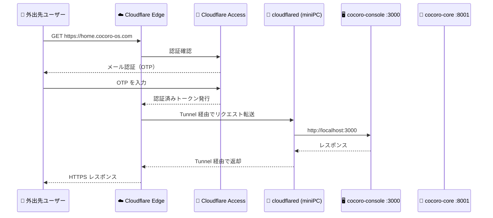

# 🌐 外部アクセス（Cloudflare Tunnel）

Cloudflare Tunnel を使うと、**グローバル IP なし・ポート開放なし**で、
外出先のスマートフォンや PC から自宅の miniPC にセキュアにアクセスできます。

---

## アクセス URL の形式

Cocoro OS の外部アクセス URL は以下の形式です：

```
https://{NODE_ID}.cocoro-os.com
```

| 例 | 用途 |
|----|------|
| `https://home.cocoro-os.com` | NODE_ID が `home` の場合 |
| `https://office-01.cocoro-os.com` | NODE_ID が `office-01` の場合 |

### エンドポイント一覧

| URL | 内容 |
|-----|------|
| `https://{NODE_ID}.cocoro-os.com` | cocoro-console（管理 UI）|
| `https://{NODE_ID}.cocoro-os.com/api` | cocoro-core REST API |
| `https://{NODE_ID}.cocoro-os.com/api/docs` | Swagger UI（API ドキュメント）|
| `https://{NODE_ID}.cocoro-os.com/api/health` | ヘルスチェック |

---

## 仕組み



---

## Cloudflare Access のメール認証

外部からアクセスする際、**Cloudflare Access** によるメール認証が挟まります。
これにより、知らない第三者が Cocoro OS にアクセスするのを防ぎます。

### 認証フロー

```
1. https://home.cocoro-os.com にアクセス
         ↓
2. Cloudflare のログインページが表示される
         ↓
3. 許可されたメールアドレスを入力
         ↓
4. そのメールに「One-Time PIN」が届く（6桁の数字）
         ↓
5. PIN を入力 → 認証完了
         ↓
6. cocoro-console にアクセスできる
   （認証は24時間有効）
```

### 認証画面のイメージ

```
┌──────────────────────────────────────────────┐
│  🔐 Cloudflare Access                        │
│──────────────────────────────────────────────│
│                                              │
│  Cocoro OS へのアクセスには認証が必要です      │
│                                              │
│  メールアドレス:                              │
│  [your-email@example.com          ]          │
│                                              │
│  [メールでPINを受け取る]                      │
│                                              │
└──────────────────────────────────────────────┘
```

---

## セットアップ手順

:::info setup-tunnel.sh を使う場合（推奨）
`setup-tunnel.sh` を実行すると以下の手順をすべて自動化します。
→ [クイックスタート](../setup/quickstart) を参照
:::

手動でセットアップする場合の手順です。

### Step 1: cloudflared のインストール

```bash
# miniPC (Debian) で実行
curl -L https://github.com/cloudflare/cloudflared/releases/latest/download/cloudflared-linux-amd64.deb \
  -o cloudflared.deb
sudo dpkg -i cloudflared.deb
cloudflared --version
# → cloudflared version 2024.x.x
```

### Step 2: Cloudflare にログイン

```bash
cloudflared tunnel login
# → ブラウザが開くので Cloudflare アカウントでログイン
# → ~/.cloudflared/cert.pem が生成される
```

### Step 3: トンネルの作成

```bash
# NODE_ID でトンネルを作成
NODE_ID="home"  # ← 任意の識別子
cloudflared tunnel create ${NODE_ID}

# UUID が発行される
# Tunnel credentials written to ~/.cloudflared/xxxxxxxx-xxxx-xxxx-xxxx-xxxxxxxxxxxx.json
```

### Step 4: 設定ファイルの作成

```yaml
# ~/.cloudflared/config.yml
tunnel: xxxxxxxx-xxxx-xxxx-xxxx-xxxxxxxxxxxx
credentials-file: /home/cocoro-admin/.cloudflared/xxxxxxxx-xxxx-xxxx-xxxx-xxxxxxxxxxxx.json

ingress:
  # cocoro-console（管理UI）
  - hostname: home.cocoro-os.com
    service: http://localhost:3000

  # cocoro-core API
  - hostname: home.cocoro-os.com
    path: /api
    service: http://localhost:8001

  # デフォルト（404）
  - service: http_status:404
```

### Step 5: DNS の設定

```bash
cloudflared tunnel route dns ${NODE_ID} ${NODE_ID}.cocoro-os.com
# → Added CNAME home.cocoro-os.com -> xxxxxxxx.cfargotunnel.com
```

### Step 6: サービスとして起動

```bash
# systemd サービスとして登録（常時起動）
sudo cloudflared service install
sudo systemctl enable cloudflared
sudo systemctl start cloudflared

# 動作確認
sudo systemctl status cloudflared
# → Active: active (running)
```

### Step 7: Cloudflare Access の設定

Cloudflare ダッシュボード → **Zero Trust** → **Access** → **Applications** で設定：

| 設定項目 | 値 |
|---------|-----|
| Application name | `Cocoro OS - {NODE_ID}` |
| Application domain | `{NODE_ID}.cocoro-os.com` |
| Session duration | `24 hours` |
| Policy name | `Owner Access` |
| Action | `Allow` |
| Include | `Emails` → 自分のメールアドレスを追加 |

---

## トンネルの状態確認

```bash
# トンネルの状態を確認
cloudflared tunnel info home

# 出力例
NAME:     home
ID:       xxxxxxxx-xxxx-xxxx-xxxx-xxxxxxxxxxxx
CREATED:  2026-03-18 14:00:00 +0900 JST
CONNECTORS:
  ID:              yyyyyyyy-yyyy-yyyy-yyyy-yyyyyyyyyyyy
  VERSION:         2024.x.x
  ARCH:            linux/amd64
  ORG:             your-org
  PRIVATE IP:      192.168.1.100
  DC:              tyo01
  CONNECTIONS:     4x quic

# ヘルスチェック（外部から）
curl -s https://home.cocoro-os.com/api/health
# → {"status": "healthy", "tunnel_status": "active"}
```

---

## よくある問題

| 症状 | 原因 | 対処 |
|------|------|------|
| アクセスできない | cloudflared が停止 | `sudo systemctl restart cloudflared` |
| 認証メールが届かない | 迷惑メールフォルダを確認 | Cloudflare からのメールを許可 |
| 403 Forbidden | Access ポリシーの設定ミス | メールアドレスが正しく登録されているか確認 |
| DNS が反映されない | TTL 待機中 | 5〜10 分待つ |
| トンネルが自動起動しない | systemd 未登録 | `sudo cloudflared service install` を再実行 |
| OTP の有効期限切れ | 10 分以内に入力が必要 | 「再送信」をクリックして新しい OTP を取得 |

---

## セキュリティのベストプラクティス

:::warning 外部公開する際の注意
- **必ず Cloudflare Access を設定してください**（認証なしの公開は危険）
- 許可するメールアドレスは最小限に留める
- 定期的に Access のログを確認する（Zero Trust → Logs）
:::

```bash
# アクセスログの確認（miniPC 側）
sudo journalctl -u cloudflared -n 50 --no-pager

# 不審なアクセスの確認
sudo journalctl -u cloudflared | grep "error\|denied\|blocked"
```

---

## LAN 内アクセスとの使い分け

| 状況 | 推奨アクセス方法 |
|------|----------------|
| 自宅 LAN 内 | `http://cocoro.local:3000`（高速・認証なし）|
| 外出先・モバイル | `https://{NODE_ID}.cocoro-os.com`（Cloudflare Tunnel）|
| 開発・デバッグ | `http://192.168.x.xxx:8001`（IP 直接接続）|
