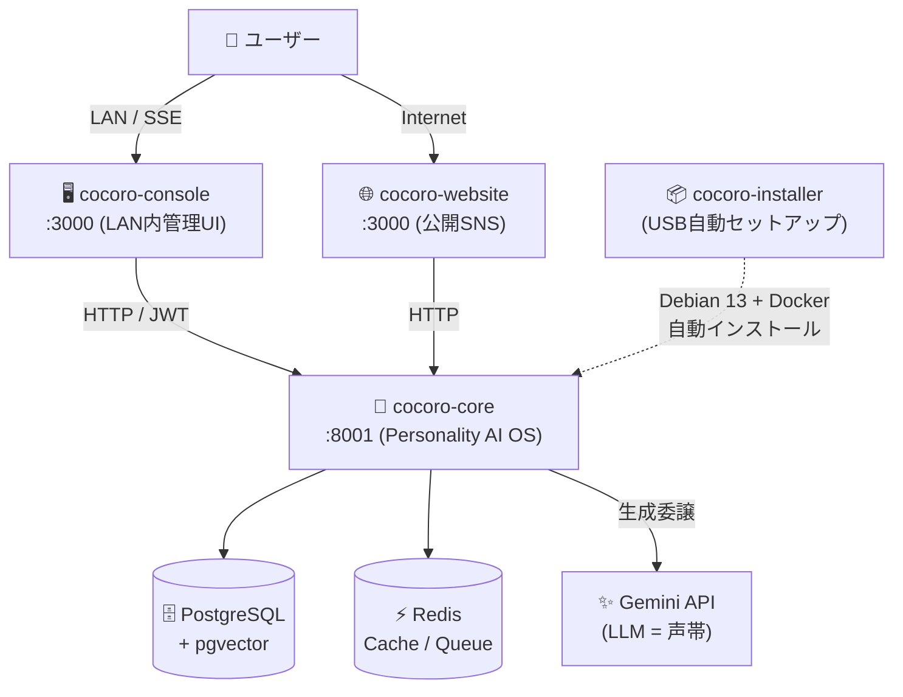

import Link from '@docusaurus/Link';

# 🧠 Cocoro OS

> **AIに「人格」を与えるOS** — LLMは声帯に過ぎない。記憶・価値観・感情・判断はCocoro OSが管理する。

---

## なぜ Cocoro OS が必要か

ChatGPT や Gemini は賢い。でも **あなただけの AI** にはなれない。

| 従来のAI | Cocoro OS |
|---------|-----------|
| 毎回リセットされる | 記憶が永続的に蓄積される |
| 昨日と今日で性格が変わる | 価値観・感情が一貫して維持される |
| クラウドに個人情報を預ける | ローカルminiPCで完全動作 |
| LLMを変えると人格が消える | LLMは声帯、人格は独立維持 |

---

## 5分でわかるクイックスタート

:::info miniPCをすでに持っている場合
ここに示す手順でcocoro-coreをDockerで起動できます。
ゼロタッチセットアップを使う場合は [インストールガイド](./getting-started/installation) へ。
:::

```bash
# 1. リポジトリをクローン
git clone https://github.com/mdl-systems/cocoro-core.git
cd cocoro-core

# 2. 環境変数を設定
cp infra/docker/.env.example infra/docker/.env
# .env を開いて GEMINI_API_KEY と COCORO_API_KEY を設定

# 3. 起動（初回は5〜10分かかります）
cd infra/docker
docker compose up -d --build

# 4. ヘルスチェック
curl http://localhost:8001/health
# → {"status": "healthy", "version": "1.0.0"}

# 5. 最初のチャット
curl -X POST http://localhost:8001/chat \
  -H "Authorization: Bearer $COCORO_API_KEY" \
  -H "Content-Type: application/json" \
  -d '{"message": "こんにちは、自己紹介して"}'
```

**Gemini API キーの取得:** [aistudio.google.com](https://aistudio.google.com) → 「Get API key」→「Create API key」（無料で使用可能）

---

## アーキテクチャ



---

## 主要機能へのクイックリンク

<div style={{display: 'grid', gridTemplateColumns: 'repeat(auto-fit, minmax(260px, 1fr))', gap: '16px', margin: '24px 0'}}>

<div style={{border: '1px solid #e8c4a0', borderRadius: '12px', padding: '20px', background: 'linear-gradient(135deg, #fffaf5 0%, #fff8f0 100%)'}}>

### 🚀 はじめる
- [必要なハードウェア](./getting-started/hardware)
- [インストール手順](./getting-started/installation)
- [Boot Wizard ガイド](./getting-started/boot-wizard)
- [最初のチャット](./getting-started/first-chat)

</div>

<div style={{border: '1px solid #c4d4e0', borderRadius: '12px', padding: '20px', background: 'linear-gradient(135deg, #f5faff 0%, #f0f8ff 100%)'}}>

### 📖 機能ガイド
- [エージェント 6 種の使い方](./guides/specialist-agents)
- [記憶・学習システム](./guides/memory-system)
- [シンクロ率の見方](./guides/sync-rate-guide)
- [タスクスケジューラー](./guides/task-scheduler)

</div>

<div style={{border: '1px solid #c4e0c4', borderRadius: '12px', padding: '20px', background: 'linear-gradient(135deg, #f5fff5 0%, #f0fff0 100%)'}}>

### 📡 API リファレンス
- [概要・認証](./api/overview)
- [POST /chat/stream](./api/chat)
- [GET /emotion/state](./api/emotion)
- [POST /agent/run](./api/agent)

</div>

<div style={{border: '1px solid #d4c4e0', borderRadius: '12px', padding: '20px', background: 'linear-gradient(135deg, #fdf5ff 0%, #faf0ff 100%)'}}>

### 🏗️ アーキテクチャ
- [11層構造の解説](./architecture)
- [エージェントシステム](./architecture/agent-system)
- [複数ノード構成](./guides/multi-node)
- [Cloudflare Tunnel](./guides/cloudflare-tunnel)

</div>

</div>

---

## Cocoro OS の 5 つの特徴

### 🧠 1. 人格の一貫性

**Memory + Values + Emotion + Decision Graph** の 4 層構造で人格を保証。
LLM（Gemini / Ollama）が変わっても人格は 100% 維持されます。

### 📦 2. ローカルファースト

Intel N95 miniPC（約3万円）上で 24 時間 365 日自律動作。
消費電力 10〜15W、年間電気代 約 1,600 円。

### 🤖 3. 自律エージェント

10 種の Function Calling ツール + 6 種の専門職ワーカーで複合タスクを自律実行。
「調べて、まとめて、スケジュールに入れて」を 1 文で完結。

### 🔒 4. プライバシー重視

AES-256-GCM + Ed25519 + IP ホワイトリスト。
管理 UI は LAN 内専用、すべてのデータはローカルに暗号化保存。

### ⚡ 5. ゼロタッチデプロイ

cocoro-installer の USB を挿すだけで全自動セットアップ。
Debian 13 → Docker → cocoro-core まで約 20 分で完了。

---

## シンクロ率について

Cocoro OS はあなたとの会話を重ねるごとに**シンクロ率**が上昇します。

```
Day 1:    5〜10%  （初期値）
Week 1:  20〜35%  （好みや習慣を学習）
Month 1: 45〜65%  （個性が安定）
Month 6: 80〜92%  （深い相互理解）
```

シンクロ率 **92%** で「Divergence Ceiling」が発動し、学習が停止します（安全装置）。
→ [シンクロ率の詳細](./guides/sync-rate-guide)

---

## 技術スペック

| 項目 | 仕様 |
|------|------|
| コアエンジン | Python 3.11 / FastAPI 0.109 |
| データベース | PostgreSQL 16 + pgvector + Redis 7 |
| LLM（クラウド）| Google Gemini 2.5 Flash |
| LLM（ローカル）| Ollama（オフライン完全対応）|
| セキュリティ | Rate Limit / IP Filter / AES-256-GCM / Ed25519 |
| テスト | 231 tests / 9 files（pytest）|
| ライセンス | Apache License 2.0 |

---

## ライセンス

```
Copyright 2026 mdl-systems
Licensed under the Apache License, Version 2.0
https://github.com/mdl-systems/cocoro-core
```
