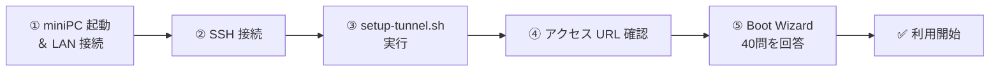

# 🚀 クイックスタート

miniPC を受け取ってから **Cocoro OS が使えるようになるまで** の最短手順です。
所要時間の目安: **約 30〜40 分**

---

## 全体の流れ



---

## ① miniPC を起動して LAN に接続

1. miniPC を LAN ケーブルでルーターに接続
2. 電源を入れる
3. 起動完了まで **約 1〜2 分** 待つ

:::tip Wi-Fi より有線 LAN を推奨
初回セットアップ時は有線 LAN ケーブルの使用を推奨します。
セットアップ完了後に Wi-Fi への切り替えが可能です。
:::

---

## ② SSH で miniPC に接続

同じ LAN 内の PC・Mac から接続します。

```bash
# mDNS で接続（推奨）
ssh cocoro-admin@cocoro.local

# mDNS が使えない場合は IP アドレスで
# IP はルーターの管理画面で確認してください
ssh cocoro-admin@192.168.x.xxx

# デフォルトパスワード
# Password: cocoro-factory-2026
```

:::warning 初回ログイン後にパスワードを変更してください
```bash
passwd
```
:::

---

## ③ setup-tunnel.sh を実行

外部アクセス（Cloudflare Tunnel）のセットアップを自動化するスクリプトです。

```bash
# cocoro-core のディレクトリに移動
cd /opt/cocoro/core

# セットアップスクリプトを実行
sudo bash setup-tunnel.sh
```

### スクリプトが行うこと

```
1. cloudflared のインストール確認・更新
2. Cloudflare アカウントへのログイン（ブラウザ認証）
3. トンネルの作成（NODE_ID が自動発行される）
4. DNS レコードの自動設定
5. systemd サービスとして登録・起動
6. cocoro-core の起動確認
```

### 対話式プロンプト

スクリプト実行中に以下の入力が求められます：

| プロンプト | 入力内容 |
|-----------|---------|
| `Cloudflare email:` | Cloudflare アカウントのメールアドレス |
| `NODE_ID (英数字):` | このノードの識別子（例: `home`, `office`, `node01`）|
| `Confirm setup? [y/N]:` | `y` を入力して確定 |

**NODE_ID の命名ルール:**
- 英数字とハイフンのみ使用可（例: `home-node`, `office-01`）
- 一度設定すると変更には再セットアップが必要
- アクセス URL のサブドメインになる: `https://{NODE_ID}.cocoro-os.com`

---

## ④ アクセス URL の確認

セットアップ完了後、以下のコマンドで URL を確認します。

```bash
# アクセス URL の表示
cat /opt/cocoro/core/.node-info

# 出力例
NODE_ID=home
CONSOLE_URL=https://home.cocoro-os.com
API_URL=https://home.cocoro-os.com/api
TUNNEL_STATUS=active
CREATED_AT=2026-03-18T14:00:00+09:00
```

### アクセス可能な URL

| URL | 用途 |
|-----|------|
| `https://{NODE_ID}.cocoro-os.com` | cocoro-console（管理 UI）|
| `https://{NODE_ID}.cocoro-os.com/api` | cocoro-core API |
| `https://{NODE_ID}.cocoro-os.com/api/docs` | Swagger UI |
| `http://cocoro.local:3000` | LAN 内アクセス（管理 UI）|
| `http://cocoro.local:8001` | LAN 内アクセス（API）|

---

## ⑤ Boot Wizard（40問）を完走する

ブラウザで `https://{NODE_ID}.cocoro-os.com` にアクセスすると、
初回は自動的に **Boot Wizard** が起動します。

### Boot Wizard の構成（8カテゴリ × 5問 = 40問）

| カテゴリ | 質問ID | 内容 | 所要時間 |
|---------|--------|------|---------|
| 基本プロフィール | id_01〜05 | 名前・職業・趣味・性格・生活リズム | 2分 |
| 価値観 | val_01〜05 | 大切にしていること・仕事の価値観 | 3分 |
| 信念 | bel_01〜05 | 世界観・テクノロジーへの態度 | 2分 |
| 意思決定スタイル | dec_01〜05 | 情報収集・判断の仕方 | 2分 |
| リスク許容度 | risk_01〜05 | 挑戦・安定のバランス | 2分 |
| 感情パターン | emo_01〜05 | 基本的な気分・人への態度 | 2分 |
| 認知スタイル | cog_01〜05 | 思考・学習のパターン | 2分 |
| 人生経験 | life_01〜05 | 挑戦・達成・転機・目標 | 5分 |

:::tip 丁寧に答えるほど初期シンクロ率が上がります
各質問に **100〜200 文字程度** で丁寧に答えることで、
初期シンクロ率が 5〜8% → **12〜18%** 程度まで上昇します。
:::

### Boot Wizard 完了後

```
✅ 設定完了！
   初期シンクロ率: 12.4%
   価値観ベクトル: 設定済み（32次元）
   感情エンジン: 起動（Joy: 0.68, Trust: 0.72）
   
→ チャット画面に移行します
```

---

## セットアップ完了の確認

```bash
# SSH で接続して確認
ssh cocoro-admin@cocoro.local

# cocoro-core のヘルスチェック
curl -s http://localhost:8001/health | python3 -m json.tool

# 期待されるレスポンス
{
  "status": "healthy",
  "version": "1.0.0",
  "llm_status": "connected",
  "memory_system": "healthy",
  "sync_rate": 12.4,
  "tunnel_status": "active"
}
```

---

## 次のステップ

| ステップ | リンク |
|---------|--------|
| 最初のチャットをしてみる | [最初のチャット](../getting-started/first-chat) |
| 外部からアクセスする | [外部アクセスガイド](../guides/external-access) |
| エージェントを使う | [専門職エージェントの使い方](../guides/specialist-agents) |
| API を使って連携する | [API リファレンス](../api/overview) |
